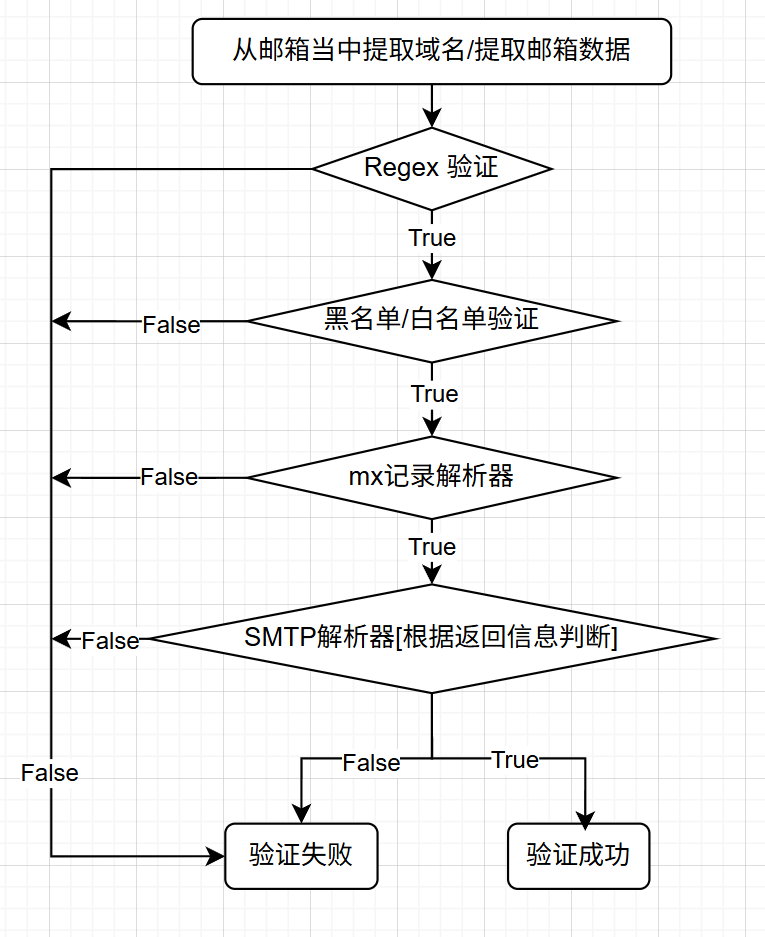

# Email-Tool  邮箱验证工具

## 功能介绍

1.正则表达式验证

2.mx记录验证[域名验证]

3.smtp记录验证[并不是100%准确,需要自定义规则]

4.并发并行化执行

5.自定义dns解析以及doh解析

6.自定义smtp响应关键词检测

7.可以根据服务器配置指令exec.Command切换自定义切换ip分批检测

## 项目结构

```
Email-Tool/
├── cmd/                      # 主程序入口
│   ├── main.go              # 程序主入口
│   ├── install.sh           # Go环境安装脚本
│   ├── uninstall.sh         # Go环境卸载脚本
│   ├── emails.txt           # 邮箱数据文件  
│   └── data/                # 输出数据目录 
├── config/                   # 配置文件目录
│   ├── config.yml           # 主配置文件
│   ├── white_list.txt       # 白名单文件           
│   └── black_list.txt       # 黑名单文件
├── internal/                 # 内部包
│   ├── controller/          # 控制器层
│   │   ├── default.go       # 默认控制器
│   │   ├── mx.go            # MX验证控制器
│   │   └── regex.go         # 正则验证控制器
│   └── models/              # 模型层
│       ├── data.go          # 数据结构定义
│       ├── smtp_default.go  # SMTP默认实现
│       ├── smtp_resolver.go # SMTP解析器
│       ├── mx_default.go    # MX默认实现
│       ├── mx_resolver.go   # MX解析器
│       └── mx_http.go       # MX HTTP实现
├── init/                     # 初始化模块
│   ├── config/              # 配置初始化
│   ├── emailData/           # 邮箱数据初始化
│   └── runLog/              # 日志初始化
├── logs/                     # 日志文件目录
├── go.mod                   # Go模块依赖
└── go.sum                   # Go依赖校验
```

## 配置文件格式

```yaml
APP:
  mode: run   #主程序运行模式 (debug)-(run)[debug为测试模式/run为运行模式]
  verifyMode: smtp #验证模式 (smtp)-(mx)-(regex)
  chunkSize:  5 #  分片大小  总数据除于你输入的数字
  regexConfig:  #语法验证配置项
    goroutines: 10   #并发协程量
    regex: ^[a-zA-Z0-9._%+\-]+@[a-zA-Z0-9.\-]+\.[a-zA-Z]{2,63}$  #语法验证的正则表达式
  mxConfig:   #mx记录配置项
    mode: doh #验证模式  (doh)-(default)
    goroutines:  50 #并发协程量
    timeout: 5s  #连接超时时间
    dnsServer: ""  #dns服务器<*> [当mode为default时填写/不填写按照本机DNS解析]
  smtpConfig:
    mode:   #验证模式
    goroutines:   50  #并发协程量
    timeout:   30s  #连接超时时间
    port:  25   #发件邮箱
    keys:    #smtp验证关键词
      - unknown user
      - unknown account
      - unknown customer
      - unknown mailbox

Data: #邮箱数据处理
  path:  ./emails.txt  #邮箱数据路径
  whiteList:   ../config/white_list.txt #白名单文件路径
  blackList:   ../config/black_list.txt  #黑名单文件路径
```


#### 验证机制 

verifyMode参数
 - smtp [smtp模式包括smtp,mx,regex验证]
 - mx [mx模式包括mx,regex验证]
 - regex [regex验证只有regex验证]


#### 流程图
[//]: # (![验证流程图]&#40;./docx/flowChart.png&#41;)


#### 运行方式

- 可以进入cmd文件夹bash 安装go过后go run main.go即可[注意GOPROXY]
- 可以 go build -o xxx 打包成二进制文件后执行
